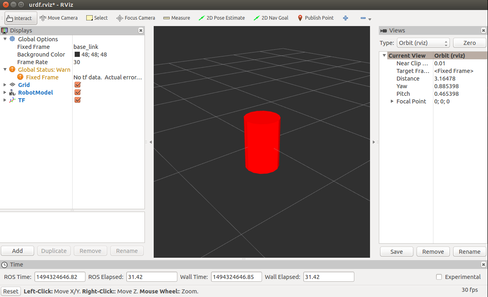

# Step 1: Building a Visual Robot Model with URDF from Scratch

## Confirm installed
* joint_state_publisher
* https://github.com/ros/urdf_tutorial.git

## Create Package
```
$ cd ~/catkin_ws/src/ros-urdf-tutorial
$ catkin_create_pkg basic_urdf_tutorial roscpp rospy
$ cd ~/catkin_ws
$ catkin_make
$ cd ~/catkin_ws/src/ros-urdf-tutorial/basic_urdf_tutorial
$ mkdir urdf
$ touch 01-myfirst.urdf
```

## 1. One Shape
Fill 01-myfirst.urdf with
```
<?xml version="1.0"?>
<robot name="myfirst">
  <link name="base_link">
    <visual>
      <geometry>
        <cylinder length="0.6" radius="0.2"/>
      </geometry>
    </visual>
  </link>
</robot>
```
Explanation: this is a robot with the name myfirst, that contains only one link (a.k.a. part), whose visual component is just a cylinder 0.6 meters long with a 0.2 meter radius.

To examine the model, launch the display.launch file: 
```
$ roslaunch urdf_tutorial display.launch model:=/home/baron/catkin_ws/src/ros-urdf-tutorial/basic_urdf_tutorial/urdf/01-myfirst.urdf
```
This does three things.

* Loads the specified model into the parameter server
* Runs nodes to publish sensor_msgs/JointState and transforms (more on these later)
* Starts Rviz with a configuration file 

Note that the roslaunch line above assumes that you are executing it from the urdf_tutorial package directory (ie: the urdf directory is a direct child of the current working directory). If that is not the case, the relative path to 01-myfirst.urdf will not be valid, and you'll receive an error as soon as roslaunch tries to load the urdf to the parameter server.

A slightly modified argument allows this to work regardless of the current working directory:
```
$ roslaunch urdf_tutorial display.launch model:='$(find basic_urdf_tutorial)/urdf/01-myfirst.urdf'
```
note the single quotes around the argument value.

After launching display.launch, you should end up with RViz showing you the following: 
 