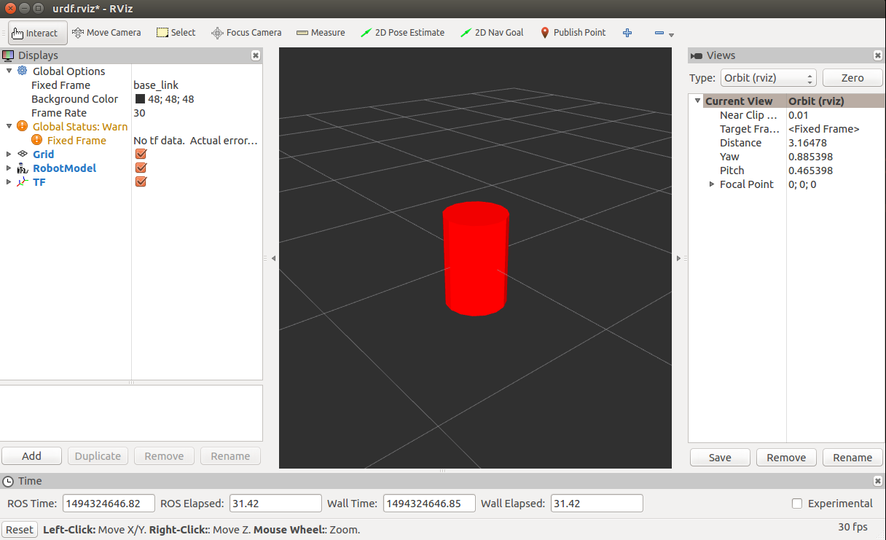
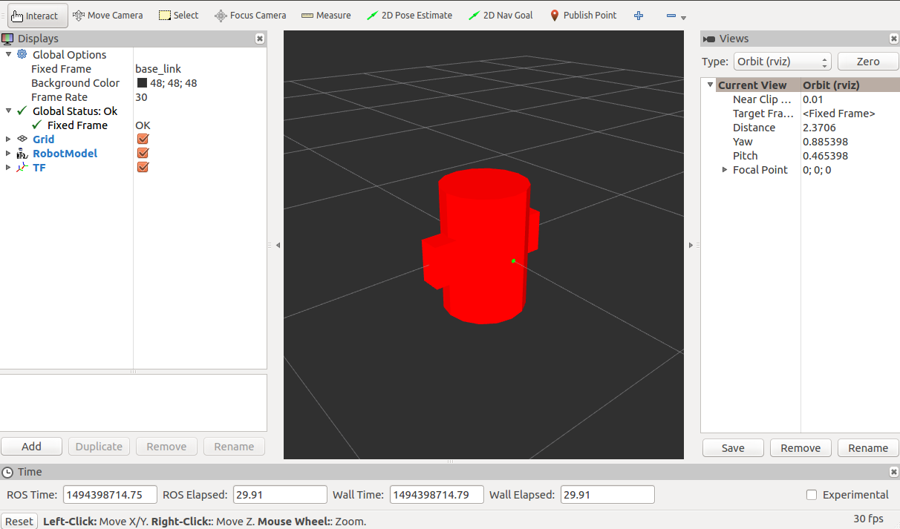
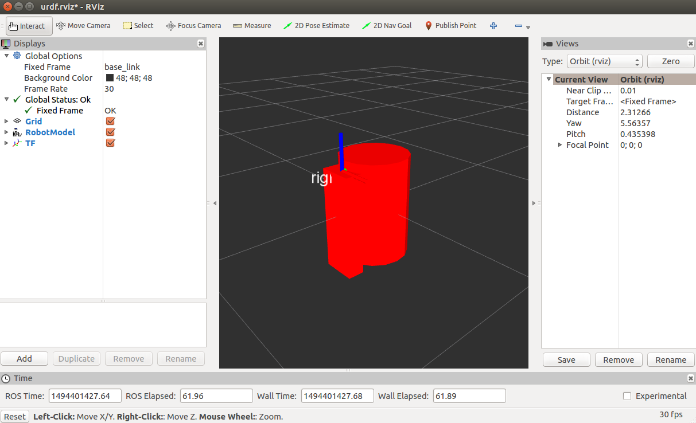
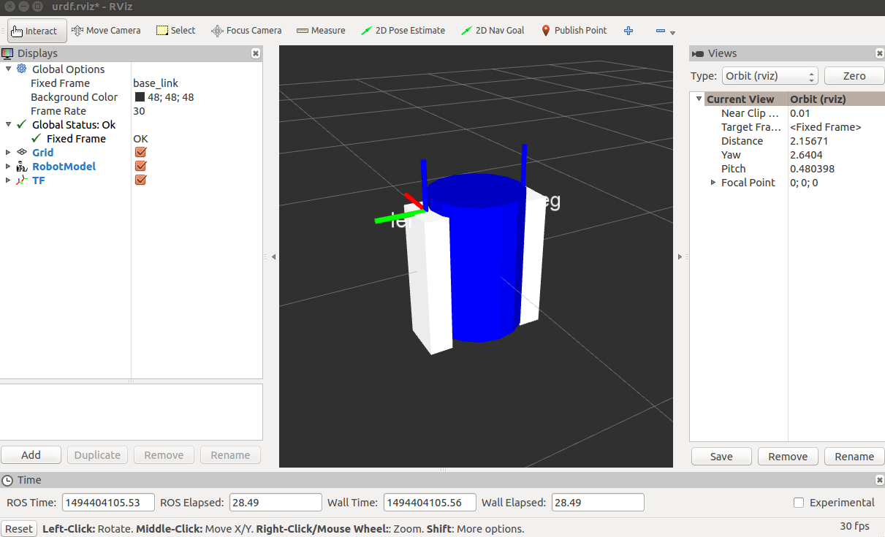
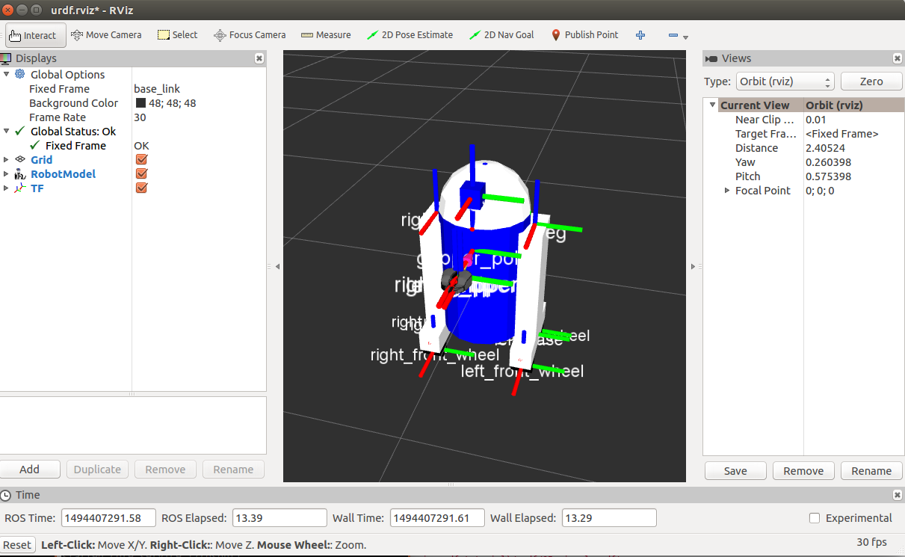

# Step 1: Building a Visual Robot Model with URDF from Scratch

## Confirm installed
* joint_state_publisher package
* urdf_tutorial package

## Create Package
```
$ cd ~/catkin_ws/src/ros-urdf-tutorial
$ catkin_create_pkg basic_urdf_tutorial roscpp rospy
$ cd ~/catkin_ws
$ catkin_make
$ cd ~/catkin_ws/src/ros-urdf-tutorial/basic_urdf_tutorial
$ mkdir urdf
$ touch 01-myfirst.urdf
```

## 1. One Shape
Fill 01-myfirst.urdf with
```
<?xml version="1.0"?>
<robot name="myfirst">
  <link name="base_link">
    <visual>
      <geometry>
        <cylinder length="0.6" radius="0.2"/>
      </geometry>
    </visual>
  </link>
</robot>
```
Explanation: this is a robot with the name myfirst, that contains only one link (a.k.a. part), whose visual component is just a cylinder 0.6 meters long with a 0.2 meter radius.

To examine the model, launch the display.launch file: 
```
$ roslaunch urdf_tutorial display.launch model:=/home/baron/catkin_ws/src/ros-urdf-tutorial/basic_urdf_tutorial/urdf/01-myfirst.urdf
```
This does three things.

* Loads the specified model into the parameter server
* Runs nodes to publish sensor_msgs/JointState and transforms (more on these later)
* Starts Rviz with a configuration file 

Note that the roslaunch line above assumes that you are executing it from the urdf_tutorial package directory (ie: the urdf directory is a direct child of the current working directory). If that is not the case, the relative path to 01-myfirst.urdf will not be valid, and you'll receive an error as soon as roslaunch tries to load the urdf to the parameter server.

A slightly modified argument allows this to work regardless of the current working directory:
```
$ roslaunch urdf_tutorial display.launch model:='$(find basic_urdf_tutorial)/urdf/01-myfirst.urdf'
```
Note: the single quotes around the argument value.

Result:
 

Note:

* The fixed frame is transform frame where the center of the grid is located. Here, it’s a frame defined by our one link, base_link.
* The visual element (the cylinder) has its origin at the center of its geometry as a default. Hence, half the cylinder is below the grid. 

## 2. Multiple Shapes
Now let’s look at how to add multiple shapes/links. If we just add more link elements to the urdf, the parser won’t know where to put them. So, we have to add joints. Joint elements can refer to both flexible and inflexible joints. We’ll start with inflexible, or fixed joints. Create a file called "02-multipleshapes.urdf" inside urdf directory and fill it the codes with below
```
<?xml version="1.0"?>
<robot name="multipleshapes">
  <link name="base_link">
    <visual>
      <geometry>
        <cylinder length="0.6" radius="0.2"/>
      </geometry>
    </visual>
  </link>

  <link name="right_leg">
    <visual>
      <geometry>
        <box size="0.6 0.1 0.2"/>
      </geometry>
    </visual>
  </link>

  <joint name="base_to_right_leg" type="fixed">
    <parent link="base_link"/>
    <child link="right_leg"/>
  </joint>

</robot>
```
Note how we defined a 0.6m x 0.1m x 0.2m box
The joint is defined in terms of a parent and a child. URDF is ultimately a tree structure with one root link. This means that the leg’s position is dependent on the base_link’s position. 
```
$ roslaunch urdf_tutorial display.launch model:='$(find basic_urdf_tutorial)/urdf/02-multipleshapes.urdf'
```
 

Both of the shapes overlap with each other, because they share the same origin. If we want them not to overlap we must define more origins. 

## 3. Origins
So R2D2’s leg attaches to the top half of his torso, on the side. So that’s where we specify the origin of the JOINT to be. Also, it doesn’t attach to the middle of the leg, it attaches to the upper part, so we must offset the origin for the leg as well. We also rotate the leg so it is upright. Create a file called "03-origins.urdf" inside urdf directory and fill it the codes with below
```
<?xml version="1.0"?>
<robot name="origins">
  <link name="base_link">
    <visual>
      <geometry>
        <cylinder length="0.6" radius="0.2"/>
      </geometry>
    </visual>
  </link>

  <link name="right_leg">
    <visual>
      <geometry>
        <box size="0.6 0.1 0.2"/>
      </geometry>
      <origin rpy="0 1.57075 0" xyz="0 0 -0.3"/>
    </visual>
  </link>

  <joint name="base_to_right_leg" type="fixed">
    <parent link="base_link"/>
    <child link="right_leg"/>
    <origin xyz="0 -0.22 0.25"/>
  </joint>

</robot>
```
* Let’s start by examining the joint’s origin. It is defined in terms of the parent’s reference frame. So we are -0.22 meters in the y direction (to our left, but to the right relative to the axes) and 0.25 meters in the z direction (up). This means that the origin for the child link will be up and to the right, regardless of the child link’s visual origin tag. Since we didn’t specify a rpy (roll pitch yaw) attribute, the child frame will be default have the same orientation as the parent frame.
* Now, looking at the leg’s visual origin, it has both a xyz and rpy offset. This defines where the center of the visual element should be, relative to its origin. Since we want the leg to attach at the top, we offset the origin down by setting the z offset to be -0.3 meters. And since we want the long part of the leg to be parallel to the z axis, we rotate the visual part PI/2 around the Y axis. 
```
$ roslaunch urdf_tutorial display.launch model:='$(find basic_urdf_tutorial)/urdf/03-origins.urdf'
```
 

* The launch file runs packages that will create TF frames for each link in your model based on your URDF. Rviz uses this information to figure out where to display each shape.
* If a TF frame does not exist for a given URDF link, then it will be placed at the origin in white 

## 4. Material Girl
Time to change color. Create a file called "04-materials.urdf" inside urdf directory and fill it the codes with below
```
<?xml version="1.0"?>
<robot name="materials">

  <material name="blue">
    <color rgba="0 0 0.8 1"/>
  </material>

  <material name="white">
    <color rgba="1 1 1 1"/>
  </material>


  <link name="base_link">
    <visual>
      <geometry>
        <cylinder length="0.6" radius="0.2"/>
      </geometry>
      <material name="blue"/>
    </visual>
  </link>

  <link name="right_leg">
    <visual>
      <geometry>
        <box size="0.6 0.1 0.2"/>
      </geometry>
      <origin rpy="0 1.57075 0" xyz="0 0 -0.3"/>
      <material name="white"/>
    </visual>
  </link>

  <joint name="base_to_right_leg" type="fixed">
    <parent link="base_link"/>
    <child link="right_leg"/>
    <origin xyz="0 -0.22 0.25"/>
  </joint>

  <link name="left_leg">
    <visual>
      <geometry>
        <box size="0.6 0.1 0.2"/>
      </geometry>
      <origin rpy="0 1.57075 0" xyz="0 0 -0.3"/>
      <material name="white"/>
    </visual>
  </link>

  <joint name="base_to_left_leg" type="fixed">
    <parent link="base_link"/>
    <child link="left_leg"/>
    <origin xyz="0 0.22 0.25"/>
  </joint>

</robot>
```

* The body is now blue. We’ve defined a new material called “blue”, with the red, green, blue and alpha channels defined as 0,0,0.8 and 1 respectively. All of the values can be in the range [0,1]. This material is then referenced by the base_link's visual element. The white material is defined similarly
* You could also define the material tag from within the visual element, and even reference it in other links. No one will even complain if you redefine it though.
* You can also use a texture to specify an image file to be used for coloring the object 
```
$ roslaunch urdf_tutorial display.launch model:='$(find basic_urdf_tutorial)/urdf/04-materials.urdf'
```
 

## 5. Finishing the model
Lets finish the model by adding a sphere and a some meshes. Create a file called "05-visual.urdf" inside urdf directory.
 
In order to use "l_finger.dae" and "l_finger_tip.dae", copy directory "rviz" and "meshes" from https://github.com/ros/urdf_tutorial.git
```
$ cd ~
$ git clone https://github.com/ros/urdf_tutorial.git
$ cd urdf_tutorial
$ cp -r meshes ~/catkin_ws/src/ros-urdf-tutorial/basic_urdf_tutorial
$ cp -r rviz ~/catkin_ws/src/ros-urdf-tutorial/basic_urdf_tutorial
```
roslaunch it
```
$ roslaunch urdf_tutorial display.launch model:='$(find basic_urdf_tutorial)/urdf/05-visual.urdf'
```
 
How to add the sphere should be fairly self explanatory 
```
  <link name="head">
    <visual>
      <geometry>
        <sphere radius="0.2"/>
      </geometry>
      <material name="white"/>
    </visual>
  </link>
```
The meshes here were borrowed from the PR2. They are separate files which you have to specify the path for. You should use the package://NAME_OF_PACKAGE/path notation. The meshes for this tutorial are located within the basic_urdf_tutorial package (copy from urdf_tutorial), in a folder called meshes. 
```
  <link name="left_gripper">
    <visual>
      <origin rpy="0.0 0 0" xyz="0 0 0"/>
      <geometry>
        <mesh filename="package://basic_urdf_tutorial/meshes/l_finger.dae"/>
      </geometry>
    </visual>
  </link>
```
* The meshes can be imported in a number of different formats. STL is fairly common, but the engine also supports DAE, which can have its own color data, meaning you don’t have to specify the color/material. Often these are in separate files. These meshes reference the .tif files also in the meshes folder.
* Meshes can also be sized using relative scaling parameters or a bounding box size.
* We could have also referred to meshes in a completely different package, i.e. package://pr2_description/meshes/gripper_v0/l_finger.dae which will work if the pr2_description package is installed. 
