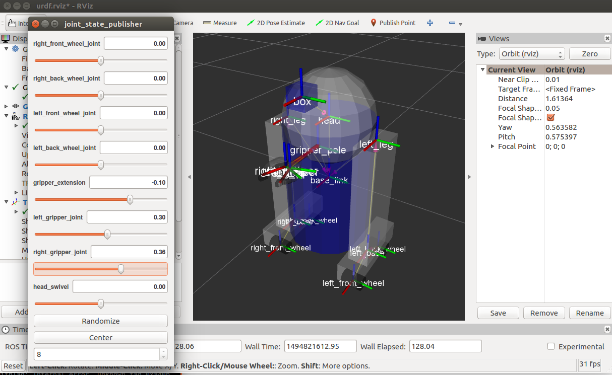

# Step 2: Building a Movable Robot Model with URDF

Create a file called “06-flexible.urdf” inside urdf directory. 
To visualize and control this model, run the same command as the last tutorial: 
```
$ roslaunch r2d2_urdf_tutorial display.launch model:='$(find r2d2_urdf_tutorial)/urdf/06-flexible.urdf'
```
However now this will also pop up a GUI that allows you to control the values of all the non-fixed joints. 
 

## 1. The Head
```
  <joint name="head_swivel" type="continuous">
    <parent link="base_link"/>
    <child link="head"/>
    <axis xyz="0 0 1"/>
    <origin xyz="0 0 0.3"/>
  </joint>
```
The connection between the body and the head is a continuous joint, meaning that it can take on any angle from negative infinity to positive infinity. The wheels are also modeled like this, so that they can roll in both directions forever.

The only additional information we have to add is the axis of rotation, here specified by an xyz triplet, which specifies a vector around which the head will rotate. Since we want it to go around the z axis, we specify the vector "0 0 1".

## 2. The Gripper
```
  <joint name="left_gripper_joint" type="revolute">
    <axis xyz="0 0 1"/>
    <limit effort="1000.0" lower="0.0" upper="0.548" velocity="0.5"/>
    <origin rpy="0 0 0" xyz="0.2 0.01 0"/>
    <parent link="gripper_pole"/>
    <child link="left_gripper"/>
  </joint>
```
Both the right and the left gripper joints are modeled as revolute joints. This means that they rotate in the same way that the continuous joints do, but they have strict limits. Hence, we must include the limit tag specifying the upper and lower limits of the joint (in radians). We also must specify a maximum velocity and effort for this joint but the actual values don't matter for our purposes here.

## 3. The Gripper Arm
```
  <joint name="gripper_extension" type="prismatic">
    <parent link="base_link"/>
    <child link="gripper_pole"/>
    <limit effort="1000.0" lower="-0.38" upper="0" velocity="0.5"/>
    <origin rpy="0 0 0" xyz="0.19 0 0.2"/>
  </joint>
```
The gripper arm is a prismatic joint. This means that it moves along an axis, not around it. This translational movement is what allows our robot model to extend and retract its gripper arm.

The limits of the prismatic arm are specified in the same way as a revolute joint, except that the units are meters, not radians.

## 4. Other Types of Joints
There are two other kinds of joints that move around in space. Whereas the prismatic joint can only move along one dimension, a planar joint can move around in a plane, or two dimensions. Furthermore, a floating joint is unconstrained, and can move around in any of the three dimensions.

## 5. Specifying the Pose
As you move the sliders around in the GUI, the model moves in Rviz. How is this done? First the GUI parses the URDF and finds all the non-fixed joints and their limits. Then, it uses the values of the sliders to publish sensor_msgs/JointState messages. Those are then used by robot_state_publisher to calculate all of transforms between the different parts. The resulting transform tree is then used to display all of the shapes in Rviz.