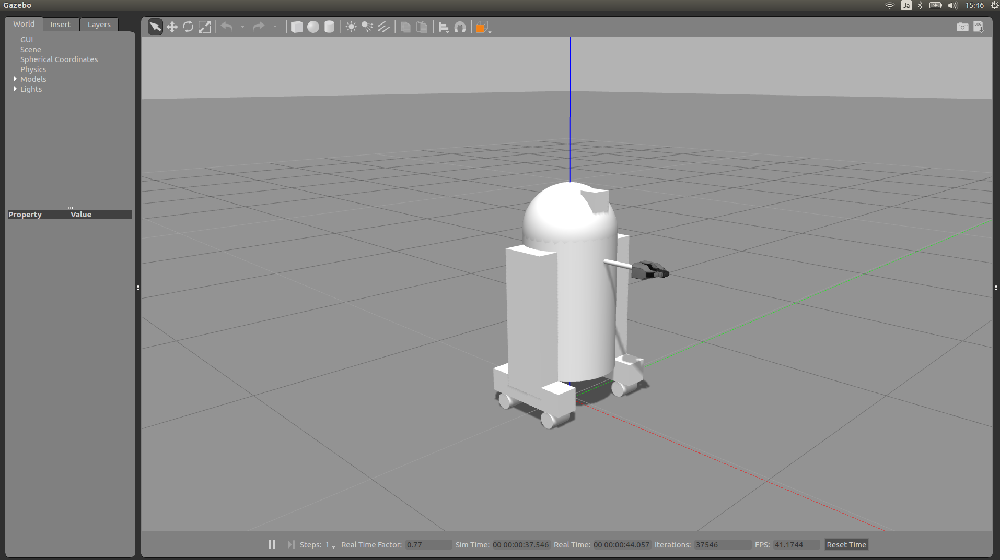

# Step 5: Using a URDF in Gazebo

## 1. Nonfunction Gazebo Interface

Spawn the model created into Gazebo using gazebo.launch
```
$ roslaunch basic_urdf_tutorial gazebo.launch model:='$(find basic_urdf_tutorial)/urdf/08-macroed.urdf.xacro'
```
This launch file

* Loads the urdf into the parameter description (as before)
* Launches an empty gazebo world
* Runs the script to read the urdf from the parameter and spawn it in gazebo.
* By default, the gazebo gui will also be displayed, and look like this:

 

However, it doesn't do anything, and is missing lots of key information that ROS would need to use this robot. Previously we had been using joint_state_publisher to specify the pose of each joint. However, the robot itself should provide that information in the real world or in gazebo. Yet without specifying that, Gazebo doesn't know to publish that information.

To get the robot to be interactive (with you and ROS), we need to specify two things: Transmissions and Plugins.

## 2. Transmissions

For every non-fixed joint, we need to specify a transmission, which tells Gazebo what to do with the joint. Let's start with the head joint. Add the following to your URDF:

```
  <transmission name="head_swivel_trans">
    <type>transmission_interface/SimpleTransmission</type>
    <actuator name="$head_swivel_motor">
      <mechanicalReduction>1</mechanicalReduction>
    </actuator>
    <joint name="head_swivel">
      <hardwareInterface>PositionJointInterface</hardwareInterface>
    </joint>
  </transmission>
```
* For introductory purposes, just treat most of this chunk of code as boilerplate.
* The first thing to note is the joint element. The name should match the joint declared earlier.
* The hardwareInterface will be important as we explore the plugins.

## 3. Gazebo Plugin
To get ROS to interact with Gazebo, we have to dynamically link to the ROS library that will tell Gazebo what to do. For that, we specify the plugin.

Add the following code to your URDF, right before the closing </robot> tag:
```
  <gazebo>
    <plugin name="gazebo_ros_control" filename="libgazebo_ros_control.so">
      <robotNamespace>/</robotNamespace>
    </plugin>
  </gazebo>
```

## 4. Spawning Controllers
We need to spawn the controllers within the plugin we already specified. This is accomplished using the controller_manager. We're going to start with two controllers: one to control the head, and one to publish JointState information.

First we need to load some parameters into the global ROS parameter space.
Copy below to config/r2_controllers.yaml
```
r2d2_joint_state_controller:
  type: "joint_state_controller/JointStateController"
  publish_rate: 50

r2d2_head_controller:
  type: "position_controllers/JointPositionController"
  joint: head_swivel
```
* The first chunk specifies to use the joint_state_controller package to publish the JointState at 50Hz.

* The second chunk specifies to use the a JointPositionController from the position_controllers package to control the head_swivel transmission. Note that hardware interface in the URDF for this joint matches the controller type.

The YAML definitions above have to be loaded onto the parameter server. Running the terminal command
```
$ rosparam load r2_controllers.yaml
```
Once these are loaded into the ROS parameter sever, we run controller_manager/spawner by running:
```
$ rosrun controller_manager spawner r2d2_joint_state_controller r2d2_head_controller
```
Note that the arguments match the parameter namespaces.

Once this is complete, Gazebo will publish the JointState of the head (and only the head) on the /joint_states topic. You can then control the position of the head by publishing a value in ROS.
```
$ rostopic pub /r2d2_head_controller/command std_msgs/Float64 "data: -0.707"
```
When this command is published, the position will immediately change to the specified value. This is because we did not specify any limits for the joint in our urdf. However, if we change the joint, it will move gradually.
```
  <joint name="head_swivel" type="continuous">
    <parent link="base_link"/>
    <child link="head"/>
    <axis xyz="0 0 1"/>
    <origin xyz="0 0 ${bodylen/2}"/>
    <limit effort="30" velocity="1.0"/>
  </joint>
```

## 5. Another Controller
We can change the URDF for the Gripper joints in a similar way. However, instead of individually controlling each joint of the gripper with its own ROS topic, we might want to group them together. For this, we just need to specify a different controller in the ROS parameters.
```
r2d2_gripper_controller:
  type: "position_controllers/JointGroupPositionController"
  joints:
    - gripper_extension
    - left_gripper_joint
    - right_gripper_joint
```
With this, we can instead speficy the position with an array of floats. Open and out:
```
$ rostopic pub  /r2d2_gripper_controller/command std_msgs/Float64MultiArray "layout:
  dim:
  - label: ''
    size: 3
    stride: 1
  data_offset: 0
data: [0, 0.5, 0.5]" 
```
Closed and retracted:
```
$ rostopic pub  /r2d2_gripper_controller/command std_msgs/Float64MultiArray "layout:
  dim:
  - label: ''
    size: 3
    stride: 1
  data_offset: 0
data: [-0.4, 0, 0]" 
```

## 6. The Wheels on the Droid Go Round and Round
To drive the robot around, we specify yet another transmission for each of the wheels from within the wheel macro.
```
    <transmission name="${prefix}_${suffix}_wheel_trans">
      <type>transmission_interface/SimpleTransmission</type>
      <actuator name="${prefix}_${suffix}_wheel_motor">
        <mechanicalReduction>1</mechanicalReduction>
      </actuator>
      <joint name="${prefix}_${suffix}_wheel_joint">
        <hardwareInterface>VelocityJointInterface</hardwareInterface>
      </joint>
    </transmission>
```
This is just like the other transmissions, except

* It uses macro parameters to specify names
* It uses a VelocityJointInterface.

Since the wheels are actually going to touch the ground and thus interact with it physically, we also specify some additional information about the material of the wheels.
```
    <gazebo reference="${prefix}_${suffix}_wheel">
      <mu1 value="200.0"/>
      <mu2 value="100.0"/>
      <kp value="10000000.0" />
      <kd value="1.0" />
      <material>Gazebo/Grey</material>
    </gazebo>
```
We could specify controllers for each of the individual wheels, but where's the fun in that? Instead we want to control all the wheels together. For that, we're going to need a lot more ROS parameters.
```
r2d2_diff_drive_controller:
  type: "diff_drive_controller/DiffDriveController"
  publish_rate: 50

  left_wheel: ['left_front_wheel_joint', 'left_back_wheel_joint']
  right_wheel: ['right_front_wheel_joint', 'right_back_wheel_joint']

  wheel_separation: 0.44

  # Odometry covariances for the encoder output of the robot. These values should
  # be tuned to your robot's sample odometry data, but these values are a good place
  # to start
  pose_covariance_diagonal: [0.001, 0.001, 0.001, 0.001, 0.001, 0.03]
  twist_covariance_diagonal: [0.001, 0.001, 0.001, 0.001, 0.001, 0.03]

  # Top level frame (link) of the robot description
  base_frame_id: base_link

  # Velocity and acceleration limits for the robot
  linear:
    x:
      has_velocity_limits    : true
      max_velocity           : 0.2   # m/s
      has_acceleration_limits: true
      max_acceleration       : 0.6   # m/s^2
  angular:
    z:
      has_velocity_limits    : true
      max_velocity           : 2.0   # rad/s
      has_acceleration_limits: true
      max_acceleration       : 6.0   # rad/s^2
```
The DiffDriveController subscribes to a standard Twist cmd_vel message and moves the robot accordingly.

## 7. Putting it All Together
The following terminal command should run all of the above modifications, allowing you to drive the R2D2 robot around using the RobotSteering panel, while also observing its actual behavior (in Gazebo) and it's visualized behavior (in RViz):
```
$ roslaunch urdf_tutorial control.launchroslaunch urdf_tutorial control.launch
```